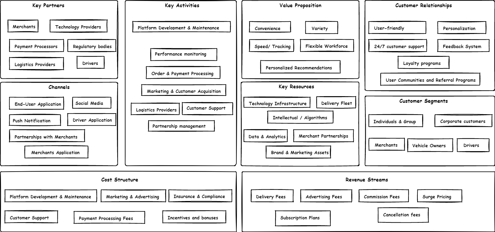
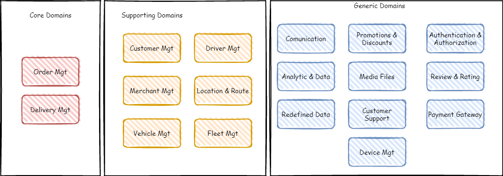
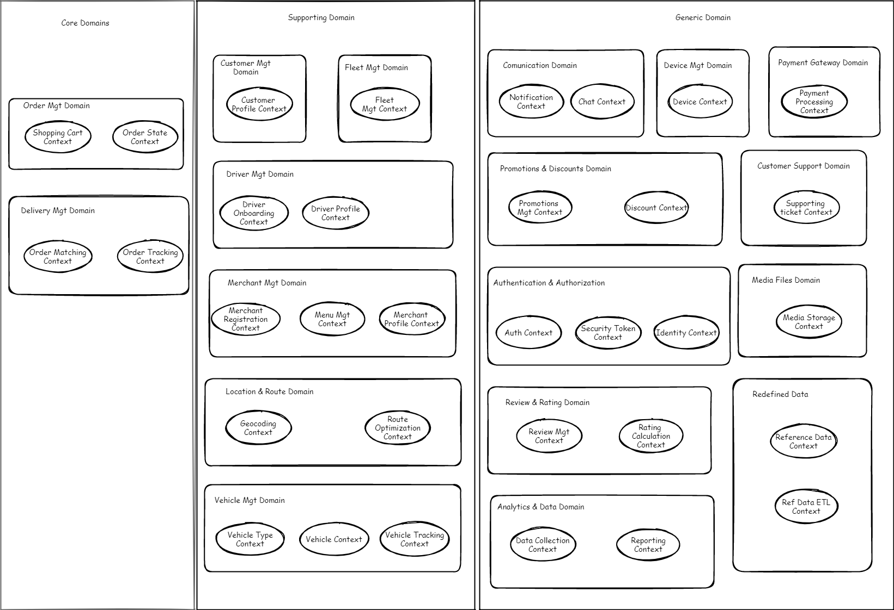
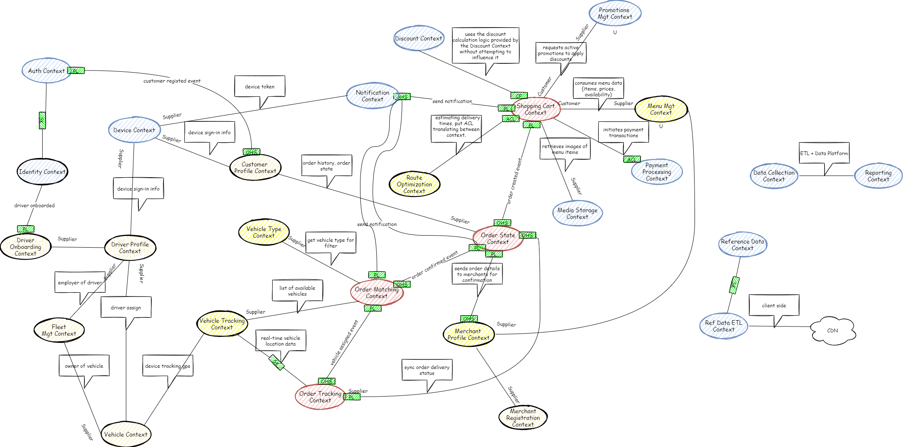

# Food Order & Delivery System Design Document

## Table of Contents
1. [Introduction](#introduction)
2. [Business Model Canvas](#business-model-canvas)
3. [Core Domains and Subdomains](#core-domains-and-subdomains)
4. [Bounded Contexts and Context Mapping](#bounded-contexts-and-context-mapping)
5. [Prioritization of Core Domains](#prioritization-of-core-domains)
6. [Bounded Context Canvas](#bounded-context-canvas)
7. [C4 Model Architecture (Level 2)](#c4-model-architecture-level-2)

---

## Introduction
This document outlines the design of a **Food Order & Delivery System** using Domain-Driven Design (DDD) principles. The design process follows a structured approach, focusing on understanding the domain, defining bounded contexts, and designing the system architecture using the C4 model.

---

## Business Model Canvas
### Objective:

### Key Elements:

- **Value Propositions**:
  - **Convenience**: Customers can order food from various restaurants without leaving their location. Options for high-end, mid-range, and budget-conscious customers.
  - **Variety**: A wide range of restaurants and cuisines available to order from a single platform.
  - **Speed/Tracking**: On-demand delivery with estimated time. Customers can track their orders in real time, from preparation to delivery.
  - **Personalized Recommendations**: Tailored suggestions based on customer preferences and past orders.
  - **Flexible Workforce**: Drivers choose their working hours, allowing for flexibility.

- **Customer Segments**:
  - **Individuals & Groups**: Different types of individual or group customers seeking convenience, varied options, and timely delivery.
  - **Corporate Customers**: Offices ordering food for employees.
  - **Merchants**: Restaurant owners looking to reach more customers and increase sales.
  - **Drivers**: Freelance delivery partners seeking flexible income.
  - **Vehicle Owners**: Fleet owners looking to make use of vehicle idle time.

- **Channels**:
  - **End-User Application**: Mobile and web apps where customers can place orders.
  - **Push Notification**: Updates on offers, promotions, and delivery status notifications (Email, SMS, in-app).
  - **Social Media**: Promotion, customer engagement, and marketing.
  - **Partnerships with Merchants**: In-app branding, loyalty programs, and direct partnerships.
  - **Driver Application**: Mobile app, the primary interface for drivers to deliver orders.
  - **Merchant Application**: Mobile and web app for merchants to manage menus, schedule, and orders.

- **Customer Relationships**:
  - **User-friendly Interface**: Easy to use and navigate for seamless food ordering.
  - **Loyalty Programs**: Rewards for frequent users (points, free meals, discounts).
  - **24/7 Customer Support**: Live chat, email, and phone support for users and merchant partners.
  - **Personalization**: Tailored recommendations based on order history and preferences.
  - **Feedback System**: Customer reviews and ratings for continuous improvement.
  - **User Communities and Referral Programs**: Encourages engagement and a sense of community among users.

- **Key Activities**:
  - **Platform Development & Maintenance**: Keeping mobile and web platforms updated.
  - **Marketing & Customer Acquisition**: Advertising campaigns, promotional offers, and branding efforts.
  - **Order & Payment Processing**: Smooth coordination of orders, payments, and payouts.
  - **Logistics Providers**: Delivery matching, route optimization, and timely delivery.
  - **Customer Support**: Resolving complaints and issues.
  - **Partnership Management**: Coordinating with merchants and keeping them engaged as essential partners.
  - **Performance Monitoring**: Tracking delivery times, driver efficiency, and customer satisfaction for continuous improvement.

- **Key Partners**:
  - **Merchants**: Restaurants offering food via the platform.
  - **Drivers**: Freelance delivery workforce.
  - **Payment Processors**: Payment gateways used to process transactions.
  - **Logistics Providers**: Vehicle leasing and support services.
  - **Technology Providers**: Cloud, analytics, maps, messaging, and email services.
  - **Regulatory Bodies**: Food safety, transportation regulations, and compliance.

- **Key Resources**:
  - **Technology Infrastructure**: Platform, servers, payment systems.
  - **Intellectual / Algorithms**: Unique algorithms for delivery optimization, data models, and patents.
  - **Delivery Fleet**: Network of freelance or contracted drivers.
  - **Merchant Partnerships**: A wide range of food suppliers.
  - **Data & Analytics**: Customer data for personalized marketing and logistics efficiency.
  - **Brand & Marketing Assets**: Promotions and advertising content.

- **Cost Structure**:
  - **Platform Development & Maintenance**: Software and infrastructure costs.
  - **Customer Support**: Costs of staff and systems for handling queries.
  - **Insurance & Compliance**: Insurance for drivers and delivery-related regulations.
  - **Marketing & Advertising**: Campaigns to acquire and retain customers.
  - **Payment Processing Fees**: Charges by payment gateways.
  - **Incentives and Bonuses**: Performance-based rewards for drivers.

- **Revenue Streams**:
  - **Delivery Fees**: Charged to customers per order or based on distance.
  - **Commission Fees**: Percentage of sales from merchants.
  - **Advertising Fees**: Merchants pay for boosted visibility.
  - **Surge Pricing**: Dynamic delivery fees based on demand.
  - **Subscription Plans**: Membership-based benefits for customers.
  - **Cancellation Fees**: Potential revenue stream to cover operational risks.

---

## Core Domains and Subdomains

- **Core Domains**:
  - **Order Management**: Responsible for handling customer orders, from creation to completion. Critical for business success as it directly affects customer satisfaction.
  - **Delivery Management**: Manages delivery assignments, driver tracking, and customer delivery coordination. High priority for optimizing service speed and reliability.

- **Supporting Domains**:
  - **Customer Management**: Manages customer profiles, preferences, and order history.
  - **Driver Management**: Oversees driver onboarding, profiles, and performance tracking.
  - **Merchant Management**: Handles merchant (restaurant owner/ food supplier) registration, menu management, and business profiles.
  - **Location & Route Management**: Optimizes routes and handles geocoding for address-to-coordinate conversion.
  - **Vehicle Management**: Manages vehicle profiles, types, and real-time vehicle tracking.
  - **Fleet Management**: Manages fleet owners, vehicles, and driver contract within the fleet.

- **Generic Domains**:
  - **Communication**: Manages notifications and chat between customers, drivers, and merchants.
  - **Promotions & Discounts**: Manages promotional offers and applies discounts to orders.
  - **Authentication & Authorization**: Manages user authentication, security tokens, and identity management.
  - **Analytics & Data**: Collects data, generates reports, and provides insights.
  - **Media Files**: Manages storage, metadata and retrieval of images and documents.
  - **Review & Rating**: Collects reviews and calculates ratings for merchants and drivers.
  - **Customer Support**: Manages customer support tickets and inquiries.
  - **Payment Gateway**: Handles secure payment processing and regulatory compliance.
  - **Redefined Data**: Manages system-wide static data and handles data exports.
  - **Device Management**: Manages user devices and tracking information.

---

#### Prioritization:
1. **Order Management**: Highest business value due to its direct impact on customer satisfaction and revenue generation.
2. **Delivery Management**: Critical for ensuring timely and efficient deliveries, directly affecting customer experience.
3. **Payment Gateway**: Important for handling financial transactions securely and maintaining user trust.
4. **Authentication & Authorization**: Essential for securing the platform, managing user access, and ensuring compliance with security protocols

---

## Bounded Contexts and Context Mapping

### Bounded Contexts:
**Core Domains**

1. **Order Management Domain**

    **Shopping Cart Context**

    - **Purpose**: Manages the customer's cart experience before an order is placed.
    - **Key Responsibilities**:
        - Cart item management (add/remove/update items).
        - Pricing and fee calculations.
        - Applying promotions and discounts.
        - Estimating delivery times (ETA).
        - Checking driver availability.
        - Validating item availability.
        - Handling extra services and special instructions.

    **Order State Context**

    - **Purpose**: Handles order states after they are placed by the customer.
    - **Key Responsibilities**:
        - Order creation from finalized carts.
        - Order processing and status updates.
        - Payment processing and confirmation.
        - Communicating with merchants for order confirmation.
        - Integrating with delivery services.

---

2. **Delivery Management Domain**

    **Order Matching Context**

    - **Purpose**: Finds and assigns orders to vehicles efficiently.
    - **Key Responsibilities**:
        - Filter suitable vehicle types from the **Vehicle Type Context**.
        - Obtain a list of available vehicles from the **Vehicle Tracking Context**.
        - Match orders with drivers based on criteria like proximity, performance, and workload.
        - Send delivery assignments to drivers and handle their responses.
        - Reassign deliveries if initial drivers are unavailable or decline.
        - Update order details with driver assignment information.
        - Communicate delivery status updates.

    **Order Tracking Context**

    - **Purpose**: Manages the execution and tracking of deliveries.
    - **Key Responsibilities**:
        - Monitor driver and vehicle locations in real-time using data from the **Vehicle Tracking Context**.
        - Update order statuses based on delivery progress (e.g., Picked Up, En Route, Delivered).
        - Send updates to customers via the **Notification Context**.
        - Ensure drivers follow optimized routes provided by the **Routing Optimization Context**.
        - Manage delivery issues like delays, driver cancellations, or customer unavailability.
        - Provide updated ETAs to customers based on real-time data.

---

**Supporting Domains**

1. **Customer Management Domain**

    **Customer Profile Context**
    - **Purpose**: Manages profiles for customers.
    - **Key Responsibilities**:
        - Handle new customer sign-ups and account creation via the **Auth Context**.
        - Allow customers to update personal information and preferences.
        - Manage saved delivery addresses and preferred locations.
        - Provide customers access to their past orders and receipts.
        - Track and manage customer rewards or loyalty points.

2. **Fleet Management Domain**

    **Fleet Management Context**
    - **Purpose**: Manages profiles and operations of fleet owners.
    - **Key Responsibilities**:
        - Register and manage fleet company profiles.
        - Manage vehicles owned by the fleet.
        - Assign drivers to vehicles within the fleet.
        - Monitor fleet performance and driver activities.
        - Handle fleet billing and payment settlements.
        - Ensure compliance with regulatory requirements for fleet operations.
        - Provide fleet administrators with access to system features and reports.

3. **Driver Management Domain**

    **Driver Onboarding Context**

    - **Purpose**: Manages driver onboarding and verification flow.
    - **Key Responsibilities**:
        - Collect applications and necessary documentation from potential drivers.
        - Conduct background checks and verify qualifications.
        - Approve driver accounts and grant system access via the **Auth Context**.
        - Notify applicants about their application status and next steps via the **Notification Context**.

    **Driver Profile Context**
    - **Purpose**: Manages driver information, whether individual or from a fleet.
    - **Key Responsibilities**:
        - Allow drivers to update personal and contact information.
        - Store and manage licenses, certifications, and insurance documents via the **Media Storage Context**.
        - Monitor document expirations and send renewal reminders.
        - Show drivers their ratings, feedback, and performance statistics.
        - Record and update vehicle information, including maintenance records, to the **Vehicle Management Context**.

4. **Merchant Management Domain**

    **Merchant Registration Context**

    - **Purpose**: Manages merchant registration and verification flow.
    - **Key Responsibilities**:
        - Collect business information and required documents from prospective merchants.
        - Verify business legitimacy, licensing, and compliance.
        - Handle agreements and terms of service acceptance.
        - Approve merchant accounts and provide onboarding assistance via the **Auth Context**.

    **Merchant Profile Context**

    - **Purpose**: Manages business profiles, payment, and billing details.
    - **Key Responsibilities**:
        - Enable merchants to update business information, hours of operation, and contact details.
        - Manage banking information for payouts and process billing.
        - Provide insights on sales, customer feedback, and operational metrics via the **Reporting Context** from the Analytics & Data Domain.

    **Menu Management Context**
    - **Purpose**: Manages menus and item offerings.
    - **Key Responsibilities**:
        - Allow merchants to create and organize menus from categories (categories data synchronized with the **Reference Data Context**).
        - Add, update, or remove menu items with descriptions, prices, and images via the **Media Storage Context**.
        - Manage stock levels and item availability in real-time.
        - Set up item options, add-ons, and promotional pricing.
        - Provide menu data to the **Shopping Cart Context** and other relevant contexts.

5. **Location & Route Domain**

    **Geocoding Context**

    - **Purpose**: Handles conversion between addresses and geographic coordinates.
    - **Key Responsibilities**:
        - Convert addresses to latitude and longitude coordinates via **External & Self-hosted Map Providers**.
        - Convert coordinates back into readable addresses (reverse geocoding).
        - Collect coordinates, addresses, and POIs to import them into the **Self-hosted Map Provider**.

    **Routing Optimization Context**

    - **Purpose**: Optimizes delivery routes and estimates delivery times to improve efficiency.
    - **Key Responsibilities**:
        - Compute optimal routes between merchants and customers.
        - Use AI algorithms and real-time data to estimate delivery times.
        - Optimize routes for drivers handling multiple deliveries.
        - Provide routing and ETA data to the **Shopping Cart Context** and **Order Tracking Context**.
        - Adjust routes dynamically based on traffic, weather, and other factors.

6. **Vehicle Management Domain**

    **Vehicle Type Context**

    - **Purpose**: Handles definitions and settings for different types of vehicles.
    - **Key Responsibilities**:
        - Define and manage different vehicle types (e.g., bicycle, motorcycle, car, van).
        - Specify capacities, dimensions, and capabilities for each vehicle type.
        - Set up extra services based on vehicle type (e.g., refrigeration, heavy load).
        - Provide vehicle type information for filtering in order matching.
        - Define which vehicle types can handle specific order requirements.
        - Serve as a reference for creating vehicle profiles in the **Vehicle Context**.

    **Vehicle Context**

    - **Purpose**: Manages individual vehicles, whether owned by individual drivers or fleets.
    - **Key Responsibilities**:
        - Register and maintain vehicle profiles, including registration details.
        - Associate vehicles with drivers and fleets.
        - Track vehicle availability and status.
        - Manage vehicle maintenance records and schedules.
        - Store vehicle documents like insurance and inspection certificates.
        - Ensure vehicles meet safety and compliance standards.

    **Vehicle Tracking Context**

    - **Purpose**: Manages real-time tracking of vehicles. The location of vehicles is synchronized and calculated by GPS from the **Device Context**, linked to the **Driver Profile Context** (current driver using that device), and associated with the **Vehicle Context** (vehicle used by that driver).
    - **Key Responsibilities**:
        - Collect and process GPS data from drivers' devices via the **Device Context**.
        - Map devices to drivers in the **Driver Profile Context** and their assigned vehicles in the **Vehicle Context**.
        - Update real-time locations of vehicles.
        - Provide location data to the **Order Tracking Context** and **Routing Optimization Context**.
        - Detect and alert for deviations from assigned routes.
        - Store historical location data for analysis.

---
**Generic Domains**

1. **Communication Domain**

    **Notification Context**

    - **Purpose**: Handles messaging and notifications.
    - **Key Responsibilities**:
        - Sending SMS, emails, and push notifications.
        - Real-time communication via WebSockets.
        - Create channels based on data synchronized from the **Device Context**, **Driver Profile Context**, and **Customer Context**.

    **Chat Context**

    - **Purpose**: Facilitates real-time chat between users, leveraging scalable technologies such as open-source or peer-to-peer solutions.
    - **Key Responsibilities**:
        - Enable real-time text communication between customers, drivers, and merchants.
        - Manage chat sessions linked to specific orders.
        - Allow sharing of images or documents within chats.
        - Ensure secure messaging with encryption and access controls.

2. **Promotions and Discounts Domain**

    **Promotions Management Context**

    - **Purpose**: Creates and manages promotional offers.
    - **Key Responsibilities**:
        - Define promotion types, rules, and conditions.
        - Set validity periods and manage active promotions.
        - Specify user segments or order criteria for promotions.
        - Generate promotion codes and manage their distribution.

    **Discount Context**

    - **Purpose**: Applies promotions and discounts to carts and orders.
    - **Key Responsibilities**:
        - Check promotion codes for validity and eligibility.
        - Apply appropriate discounts to cart totals.
        - Handle scenarios with multiple promotions and determine applicability.
        - Update cart totals in real-time as discounts are applied.

3. **Payment Gateway Domain**

    **Payment Processing Context**

    - **Purpose**: Handles payment transactions securely, adhering to PCI DSS standards.
    - **Key Responsibilities**:
        - Accept various payment options like credit cards, digital wallets, etc.
        - Ensure all transactions comply with PCI DSS and other relevant regulations.
        - Connect to third-party payment providers securely.
        - Process refunds and handle payment disputes.
        - Maintain detailed records of all payment activities.

4. **Customer Support Domain**

    **Support Ticket Context**
    - **Purpose**: Manages customer support interactions using third-party solutions like AWS Connect or XCally.
    - **Key Responsibilities**:
        - Enable users to submit support requests and track their progress.
        - Assign tickets to support agents and manage resolution steps.
        - Provide self-help resources to users based on their inquiries.
        - Accept support requests via app, email, chat, or phone.

5. **Media Files Domain**

    **Media Storage Context**

    - **Purpose**: Manages storage and retrieval of media files.
    - **Key Responsibilities**:
        - Handle uploads from users and contexts requiring media storage.
        - Ensure secure access to media files with proper permissions.
        - Perform image resizing, format conversions, and thumbnail generation.
        - Manage the lifecycle of media files, including archiving and deletion.

6. **Authentication & Authorization Domain**

    **Auth Context**

    - **Purpose**: Manages user account registration, login, password management, and authentication processes.
    - **Key Responsibilities**:
        - Handle sign-ups for customers.
        - Manage login and logout for customers, drivers, merchants, and staff.
        - Provide password reset and recovery mechanisms.
        - Support 2FA like OTP or SMS verification.
        - Record user actions for security and compliance.

    **Security Token Context**

    - **Purpose**: Verifies tokens, validates API permissions, and handles authentication and authorization checks.
    - **Key Responsibilities**:
        - Validate JWTs or other token types generated from the **Auth Context** when users log in.
        - Verify user permissions for accessing resources.
        - Manage session timeouts and token refresh processes.
        - Invalidate tokens when necessary (e.g., after password changes).

    **Identity Context**

    - **Purpose**: Manages user accounts across different user types and defines scopes and permissions.
    - **Key Responsibilities**:
        - Define user roles and associated permissions.
        - Maintain consistent user identities across the system.
        - Enforce access rules for system features and data.
        - Create accounts for drivers via the **Driver Onboarding Context**, staff, and merchants via the **Merchant Registration Context**.

7. **Review & Rating Domain**

    **Review Management Context**

    - **Purpose**: Collects and manages user reviews.
    - **Key Responsibilities**:
        - Allow customers to submit reviews for merchants and drivers.
        - Monitor reviews for inappropriate content and enforce guidelines.
        - Provide reviews to be displayed in user profiles (to the **Customer Profile Context**) and listings.

    **Rating Calculation Context**

    - **Purpose**: Calculates and updates ratings.
    - **Key Responsibilities**:
        - Compute average ratings based on collected reviews.
        - Update merchant and driver profiles with current ratings.

8. **Analytics & Data Domain**

    **Data Collection Context**

    - **Purpose**: Captures data and events from across the system.
    - **Key Responsibilities**:
        - Record system events, transactions, and user interactions.
        - Extract, transfer, and store data for analysis.
        - Ensure data handling meets regulatory requirements (e.g., GDPR).

    **Reporting Context**

    - **Purpose**: Provides insights through reports and dashboards.
    - **Key Responsibilities**:
        - Develop visualizations for key performance indicators.
        - Generate reports based on specific criteria or timeframes.
        - Control access to sensitive reports based on user roles.
        - Utilize data to forecast trends and inform decision-making.
        - Use data from the data mart/gold layer of the data platform.

9. **Reference Data Domain**

    **Reference Data Context**

    - **Purpose**: Manages system-wide static data with CRUD operations.
    - **Key Responsibilities**:
        - Create and maintain reference data like categories, regions, holidays, etc.
        - Provide consistent reference data to other contexts.
        - Handle data variations for different locales and languages.

    **Data Exporter Context**

    - **Purpose**: Handles CDC (Change Data Capture) and ETL processes, exporting data to other contexts or services.
    - **Key Responsibilities**:
        - Export data from the **Reference Data Context** to other contexts.
        - Convert data into required formats for consuming contexts.
        - Provide consistent reference data to other contexts.
        - Export data to external services as needed.
        - Export data to client-side applications (web, app, etc.) to CDN.
  
10. **Device Mgt Domain**
    **Device Context**
    - **Purpose**: Manages device-related information and handles tracking data for users (customers and drivers).
    - **Key Responsibilities**:
        - Register and manage devices used by customers and drivers.
        - Store device identifiers, tokens, models, and capabilities.
        - Handle device authentication and ensure secure communication.
        - Provide device information to the Notification Context for channel creation.
        - Collect GPS data from driver devices for location tracking.
        - Manage device tokens for push notifications.

### Context Map:

---

## Prioritization of Core Domains
### Objective:
Rank core domains based on their business value and complexity.

### Prioritized Domains:

| **Priority** | **Domain**| **Business Value** | **Complexity** | **Description**|
|--------------|-----------|--------------------|----------------|------------------|
| 1 | **Order Management Domain**| Highest business value as it directly handles orders, which are central to the platform’s operations and revenue.|**Medium**: Interfaces with multiple other domains like Payment Processing, Delivery, and Merchant Management.| Critical to customer satisfaction and revenue generation. Handles cart, order processing.|
| 2 | **Delivery Management Domain**| Ensures efficient and timely deliveries, which are essential for customer satisfaction.| **High**: Real-time tracking, vehicle assignment, and route optimization increase complexity.| Core to customer experience. Directly affects delivery performance, including driver assignments and order tracking.|
| 3 | **Authentication & Authorization Domain** | Essential for secure user access and management, impacting all user roles (customers, drivers, merchants) and compliance with security standards. | **High**: Manages user roles, permissions, token security, and API access control. | High complexity due to secure access control and integration with all contexts for secure authentication and authorization.|
| 4 | **Payment Gateway Domain** | Reliable payment processing is vital for revenue flow and maintaining customer trust. | **Medium**: Involves secure third-party integrations and financial regulation compliance. | Critical for processing payments, ensuring PCI DSS, and managing refunds. Integral to generating revenue and maintaining trust.|
| 5 | **Customer Management Domain** | Manages customer profiles and loyalty programs, helping to drive customer retention and personalized experiences.| **Medium**: Manages customer data, preferences, addresses, and loyalty programs.| Important for personalized customer experiences but does not directly affect operational functionality as much as Order or Delivery.|
| 6 | **Merchant Management Domain** | Ensures that merchants can manage their offerings, profiles, and sales data, which helps maintain the supply side of the platform. | **Medium**: Interfaces with Menu Management, Order Management, and Payment Processing.| Key to enabling merchants to manage their own operations efficiently. Interfaces with menu and order contexts for smooth operations. |
| 7 | **Fleet Management Domain** | Supports larger delivery operations by managing multiple drivers and vehicles.| **Medium**: Involves managing fleet data, assigning drivers, and ensuring regulatory compliance.| Essential for scaling delivery operations. Enables efficient management of fleet resources and assignment of drivers.|
| 8 | **Promotions & Discounts Domain** | Drives customer acquisition and retention through discounts and promotional offers.| **Low**: Less complex, mainly involves applying rules for discounts and promotions.| Adds business value by encouraging customer activity, though less critical compared to core operational domains.|
| 9 | **Driver Management Domain**| Ensures drivers are properly onboarded and their profiles are up-to-date, which is crucial for operational scalability and driver performance management.| **Medium**: Involves managing driver onboarding, verification, and performance tracking.| Crucial for onboarding and maintaining a reliable driver network.|
| 10 | **Vehicle Management Domain**| Manages vehicles, which are critical to delivering the core service, but are more operationally focused.| **Medium**: Involves managing vehicle types, real-time tracking, and availability.| |
| 11 | **Communication Domain** | Facilitates notifications and real-time chat between users, which enhances customer experience and operational efficiency.| **Low**: Sending notifications and enabling chat is relatively straightforward compared to core domains.| |
| 12 | **Review & Rating Domain**| Allows customers to provide feedback on orders and drivers, helping to maintain service quality and customer trust.| **Low**: Primarily involves collecting and processing user feedback and displaying average ratings. | |
| 13| **Analytics & Data Domain** | Provides insights into business operations, helping to inform strategy and improve decision-making processes. | **High**: Involves collecting, processing, and reporting data, and ensuring compliance with data privacy regulations.| Adds long-term value by enabling data-driven decisions. Complexity lies in integrating multiple data sources, ensuring quality and reporting across the system.|
| 14 | **Media Files Domain**| Supports media storage for documents and images. | **Low**: Straightforward file storage and retrieval, with minimal complexity.| Necessary for operational purposes, such as storing menu images or vehicle documentation, but has low business impact compared to core services like order management or delivery.|
| 15 | **Customer Support Domain**| Handles customer support interactions, helping to maintain customer satisfaction and resolve issues quickly.| **Low**: Ticket management is well-defined, using third-party solutions like AWS Connect or XCally.| Provides long-term value for maintaining customer satisfaction but is less critical compared to core order, delivery, or payment services.|
| 16 | **Reference Data Domain** | Provides static system-wide data like categories, regions, and holidays to all other contexts, ensuring consistency. | **Low**: Primarily involves managing and providing reference data to other contexts. | Important for system consistency and efficient operation, but its role is more foundational and supportive rather than driving core functions.|
| 17 | **Device Management Domain** | Manages devices (e.g., driver smartphones) used for tracking and communications. | **Low**: Involves managing device registration, tokens, and tracking information.| Supports key services like delivery tracking and notification but plays a supporting role rather than a core business driver.|

---

## Bounded Context Canvas
### Objective:
### 1. **Shopping Cart Bounded Context**:

### 2. **Order State Bounded Context**:

### 3. **Order Matching Bounded Context**:

---

## C4 Model Architecture (Level 2)
### Objective:
Create a container diagram that illustrates how major system components interact.

### System Components:

1. **Clients:**
   - **Customer Client**: Includes mobile app and web app used by customers to browse menus, place orders, and track deliveries.
   - **Merchant Client**: Mobile and web app used by merchants to manage their profiles, menus, and orders.
   - **Driver Client**: Mobile app for drivers to receive delivery assignments, track order statuses, and update location.
   - **Admin Client**: Web app for administrators to manage system configurations, support, and operations.

2. **API Gateways:**
   - **Customer API Gateway**: Routes customer requests to backend services such as order management, customer profile, and notifications.
   - **Merchant API Gateway**: Handles requests from merchants for managing menus, profiles, and orders.
   - **Driver API Gateway**: Routes driver-specific requests, such as tracking and assignment updates, to the appropriate services.
   - **Admin API Gateway**: Handles administrator functions, such as reporting, configuration, and fleet management.

3. **Authentication & Authorization:**
   - **Authentication Server**: Manages user login and access control.
   - **Security Token System**: Issues and validates security tokens for secure API access.
   - **Identity Services**: Manages user roles and identity (customers, merchants, drivers, staffs).

4. **Core Domains:**
   - **Order Management Domain**:
     - **Shopping Cart Service**: Manages customer carts, pricing, promotions, and availability checks.
     - **Order State Service**: Manages the lifecycle of customer orders, from placement to completion.
   
   - **Delivery Management Domain**:
     - **Order Matching Service**: Matches drivers with orders based on location, capacity, and availability.
     - **Order Tracking Service**: Tracks real-time driver locations and updates order statuses.
   
   - **Customer Management Domain**:
     - **Customer Profile Service**: Manages customer data, order history, and preferences.

   - **Driver Management Domain**:
     - **Driver Onboarding Service**: Manages the onboarding and verification process for drivers.
     - **Driver Profile Service**: Handles driver data, performance, and availability.
     - **Fleet Management Service**: Manages fleets, including drivers and vehicles.

   - **Merchant Management Domain**:
     - **Merchant Registration Service**: Onboards new merchants and manages their profiles.
     - **Menu Management Service**: Manages merchant menus, item availability, and pricing.

   - **Vehicle Management Domain**:
     - **Vehicle Type Service**: Manages definitions of vehicle types and capabilities.
     - **Vehicle Service**: Manages vehicle profiles and assignments to drivers.
     - **Vehicle Tracking Service**: Tracks real-time vehicle locations.

5. **Supporting Services:**
   - **Notification Service**: Sends notifications to customers, drivers, and merchants via email, SMS, or push notifications.
   - **Payment Processing Service**: Manages secure transactions and integrates with external payment gateways.
   - **Promotions & Discounts Domain**:
     - **Promotion Management Service**: Manages promotional offers.
     - **Discount Calculation Service**: Calculates applicable discounts for customer orders.

6. **Media & File Storage:**
   - **Media Storage Service**: Manages media file uploads and retrievals: images and driver documents, save metadata of files

7. **Location & Route Domain**:
   - **Geocoding Service**: Converts addresses to geographic coordinates.
   - **Route Optimization Service**: Calculates the most efficient delivery routes and provides real-time ETAs (with unquie algorithm).

8. **Reference Data Domain**:
   - **Core Data API**: Manages static reference data like categories and regions.
   - **ETL Process**: Manages the extraction, transformation, and loading of data to various contexts.

9. **Analytics & Data Domain**:
   - **Analytics Adapter**: Collects data from multiple sources for reporting and analysis.
   - **Reporting Service**: Generates reports for admin insights, using raw and processed data.

10. **External Systems:**
    - **CDN (Content Delivery Network)**: Delivers static files and client-side data to applications.

---

### Communication Path:

1. **Client Requests**:
   - Clients (Customer, Merchant, Driver, Admin) interact with the system via their respective **API Gateways** (e.g., Customer API Gateway, Merchant API Gateway).
   - Requests are routed through the API Gateways to their relevant backend services (e.g., Shopping Cart, Order State, Driver Profile).

2. **Authentication & Authorization**:
   - Each client interaction first checks with the **Authentication Server**, where the **Security Token System** verifies tokens to ensure the request is authorized.
   - **Identity Services** manage user roles and control access to the appropriate system components based on their roles (e.g., customer, driver, merchant).

3. **Order Lifecycle**:
   - Customers submit orders via the **Shopping Cart Service**, which interacts with the **Order State Service** to confirm and track the order.
   - The **Order Matching Service** assigns drivers to the order based on the driver’s real-time location and availability from the **Vehicle Tracking Service**.
   - **Order Tracking Service** provides real-time status updates to customers through the **Notification Service**.

4. **Delivery Management**:
   - **Order Matching Service** communicates with the **Driver Profile Service** and **Vehicle Tracking Service** to find available drivers and track deliveries.
   - **Route Optimization Service** calculates delivery routes and updates drivers with real-time ETAs.

5. **Payment Processing**:
   - Once an order is placed, the **Order State Service** interacts with the **Payment Processing Service** to complete the transaction.
   - Payment information is securely processed and integrated with external payment gateways.

6. **Notification and Communication**:
   - Customers, merchants, and drivers receive updates via the **Notification Service**, which integrates with the **Device Management Domain** to ensure notifications are sent to the correct devices.

7. **Analytics & Reporting**:
   - Data from all interactions (e.g., order placements, deliveries, payments) is collected via the **Analytics Adapter**.
   - The **Reporting Service** generates insights and reports for admin and business intelligence purposes.

8. **Static & Media Storage**:
   - Images and media files (e.g., menu photos, driver documents) are stored and retrieved by the **Media Storage Service**, which connects to the **S3 Storage** for persistence.